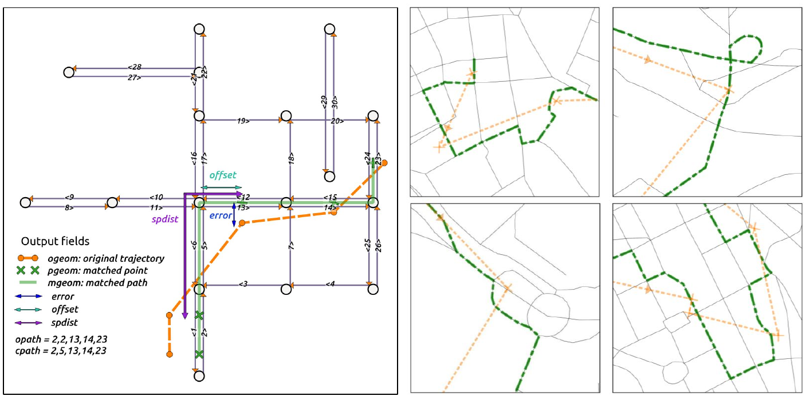

# Fast map matching (FMM) 

This project is an open source implementation of the fast map matching (FMM) algorithm in C++. The algorithm employs a prevalent hidden Markov model to solve map matching problem and addresses the bottleneck of repeated routing queries by precomputing an upper-bounded origin destination table (UBODT). 

Experiments on a large real-world dataset report a **single processor** map matching speed of **25000-45000 points/second**.

For details of the algorithm, refer to the paper [Fast map matching, an algorithm integrating hidden Markov model with precomputation](http://www.tandfonline.com/doi/full/10.1080/13658816.2017.1400548)



## Table of Contents

- [Install](#install)
- [Example](#example)
- [Input and output](#input-and-output)
- [Configuration](#configuration)
- [Performance measurement](#performance-measurement)
- [Optimization on large network](#optimization-on-large-network)
- [Contact and citation](#contact-and-citation)

## Install

### Requirements

- Linux/Unix environment (tested on Ubuntu 14.04)
- gcc >= 4.4 (gnu++11 used)
- [GDAL](http://www.gdal.org/) >= 1.11.2: IO with ESRI shapefile, Geometry data type
- [Boost Graph](http://www.boost.org/doc/libs/1_65_1/libs/graph/doc/index.html) >= 1.54.0: routing algorithms used in UBODT Generator
- [Boost Geometry](http://www.boost.org/doc/libs/1_65_1/libs/geometry/doc/html/index.html) >= 1.54.0: Rtree, Geometry computation

The required libraries can be installed with 

    sudo apt-get install gdal-bin libgdal-dev libboost-dev

### Installation

Change to the project directory, open a terminal and run

    make  

It will build executable files under the `dist` folder:

- `ubodt_gen`: the Upper bounded origin destination table (UBODT) generator (precomputation) program
- `fmm`: the map matching program

Then run 

    make install

It will copy the executable files into the `~/bin` path, which should be added to the `PATH` variable by default. 

To manually add the `~/bin` path to `$PATH` variable, open a new terminal and run:

    echo 'export PATH=$PATH:$HOME/bin' >> ~/.bashrc
    source ~/.bashrc

### Verfication of installation

Open a new terminal and type `fmm`, you should see the following output:

    ------------ Fast map matching (FMM) ------------
    ------------     Author: Can Yang    ------------
    ------------   Version: 2017.11.11   ------------
    ------------     Applicaton: fmm     ------------
    No configuration file supplied
    A configuration file is given in the example folder
    Run `fmm config.xml`

## Example

A simple example of map matching is provided in the [example](example) folder. 

## Input and output

### Input

Two files should be prepared for the map matching program:

1. GPS trajectory file: an ESRI shapefile (LineString) with an **ID field**. Each row stores a trajectory. 
2. Network file: an ESRI shapefile (LineString), each row stores a network edge with **ID, source and target fields**, which defines the topology of network graph.

For more details, please to refer to the [ubodt configuration](#configuration-of-ubodt_gen) and [fmm configuration](#configuration-of-fmm).

#### Useful resources

If you already have a road network file in GDAL supported formats, e.g., ESRI shp, GeoJSON and CSV, you may encounter a problem of creating topology of the network, namely, defining id, source and target fields. Spatial database [PostGIS](http://postgis.net/) and its extension [pgRouting](http://pgrouting.org/) can solve the problem:

1. [Add shapefiles to PostGIS database](https://gis.stackexchange.com/questions/41799/adding-shapefiles-to-postgis-database)
2. [Create topology of road network with the function pgr_createTopology in pgrouting](http://docs.pgrouting.org/2.2/en/src/topology/doc/pgr_createTopology.html)
3. [Export PostGIS table to shapefile](https://gis.stackexchange.com/questions/55206/how-can-i-get-a-shapefile-from-a-postgis-query)


### Output

The output of program `ubodt_gen` is a CSV file containing the following information:

- source: source (origin) node 
- target: target (destination) node 
- next_n: the next node visited after source in the shortest path
- prev_n: the previous node visited before target in the shortest path
- next_e: the next **edge index** visited after source in the shortest path
- distance: the shortest path distance

The output of program `fmm` is a CSV file containing the following information:

- id: id of trajectory
- o_path: optimal path, edges matched for each point in a trajectory
- c_path: complete path, edges traversed by the trajectory
- geom: geometry of the complete path 

**Note**: In UBODT, the edge index is stored in `next_e`. However, in the final output, the element is exported as the id attribute of edge specified by the configuration `fmm_config>network>id`, which is a string value. 

## Configuration

Two example configuration files are given in the [example](example) folder.

- ubodt_config.xml: configuration file for the ubodt_gen program.
- fmm_config.xml: configuration file for the fmm program

### Configuration of ubodt_gen

- ubodt_config
    + input
        * network
            - file: network file in ESRI shapefile format
            - id: column name storing id
            - source: column name storing source
            - target: column name storing target
    + parameters
        * delta: Upper bound of shortest path distance
    + output
        * file: output file in CSV format

### Configuration of fmm

- fmm_config
    * input
        - ubodt
            + file: ubodt file path
            + nhash: hashtable bucket size, recommended to be a prime number
            + multipler: used to get a unique key as `n_o*multiplier+n_d` in hash table, recommended to be the number of nodes in network file
        - network
            + file: network file path, in ESRI shapefile format
            + id: column name storing id
            + source: column name storing source
            + target: column name storing target
        - gps
            + file: GPS trajectory file path, in ESRI shapefile format
            + id: column name storing id
    * parameters
        - k: number of candidates in MM
        - r: search radius r
        - pf: penalty factor for reversed movement
        - gps_error: error used in emission probability calculation
    * output
        - mode: output mode
            + 0: id + o_path + c_path (Default mode)
            + 1: id + o_path + c_path + geom(wkb)
            + 2: id + o_path + c_path + geom(wkt) // consumes a lot of storage, for small data set
            + 3: id + o_path + (L-offset) + c_path
        - file: the matched file

## Performance measurement

A case study is reported in the paper with real world datasets:

- GPS: 644,695 trajectories containing 6,812,720 points
- Road network: 23,921 nodes and 57,928 directed edges 
- UBODT size: 4,305,012 rows
- k = 8 (candidate set size), r = 300 meters (search radius)

The speed of map matching is about:

- 25000 points/s (WKB Geometry output, mode 1)
- 45000 points/s (No geometry output, mode 0)

### Optimization on large network

In case of a large road network with hundreds of thousand of nodes, the driving distance function used in pgrouting and BGL can be slow as it requires initializing two vectors with graph size in order to maintain the output of routing. An optimized version is designed in the `src/network_graph_opt.hpp`
by regularly updating the two vectors for each source node. 

To run the optimized ubodt precomputation app, 

```
ubodt_gen_opt ubodt_config.xml
```

Statistics on the network of Netherland (700k nodes and 1 million edges)
http://geodata.nationaalgeoregister.nl/nwbwegen/extract/nwbwegen.zip

| delta (m) | running time | rows       | file size |
|-----------|--------------|------------|-----------|
| 1000      | 3min27.5s    | 19,022,620 | 766 MB    |
| 3000      | 4min32.9s    | 79,998,367 | 3,2GB     |


## Contact and citation

Can Yang, Ph.D. student at KTH, Royal Institute of Technology in Sweden 

Email: cyang(at)kth.se

Homepage: https://people.kth.se/~cyang/

Please cite fmm in your publications if it helps your research:

    Can Yang & Győző Gidófalvi (2018) Fast map matching, an algorithm
    integrating hidden Markov model with precomputation, International Journal of Geographical Information Science, 32:3, 547-570, DOI: 10.1080/13658816.2017.1400548

Bibtex file

    @article{doi:10.1080/13658816.2017.1400548,
    author = {Can Yang and Győző Gidófalvi},
    title = {Fast map matching, an algorithm integrating hidden Markov model with precomputation},
    journal = {International Journal of Geographical Information Science},
    volume = {32},
    number = {3},
    pages = {547-570},
    year  = {2018},
    publisher = {Taylor & Francis},
    doi = {10.1080/13658816.2017.1400548},
    URL = { 
            https://doi.org/10.1080/13658816.2017.1400548
    },
    eprint = { 
            https://doi.org/10.1080/13658816.2017.1400548   
    }
    }


