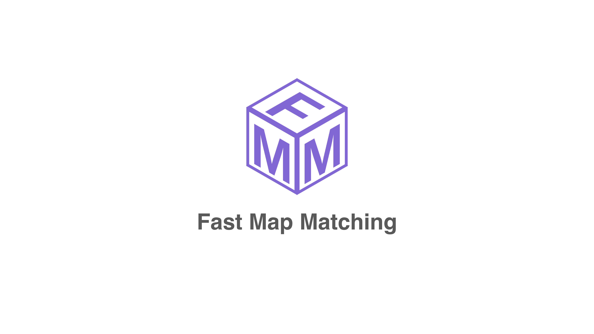

  

FMM is an open source map matching framework in C++ and Python. It solves the problem of matching noisy GPS data to a road network. The design considers maximizing performance, scalability and functionality.

### Features

- **High performance**: C++ implementation using Rtree, optimized routing, parallel computing (OpenMP).
- **Python API**: [jupyter-notebook](example/notebook) and [web demo](example/web_demo)
- **Scalibility**: millions of GPS points and millions of road edges.  
- **Multiple data format**: GPS data in Point CSV, Trajectory CSV and Trajectory Shapefile ([more details](https://fmm-wiki.github.io/docs/documentation/input/#gps-data)). Road network in ESRI shapefile or Geopackage. OSM network can also be supported with [manual preprocessing](https://github.com/cyang-kth/osm_mapmatching).
- **Detailed matching information**: traversed path, geometry, individual matched edges, GPS error, etc. More information at [here](https://fmm-wiki.github.io/docs/documentation/output/).
- **Multiple algorithms**: [FMM](http://www.tandfonline.com/doi/full/10.1080/13658816.2017.1400548) (for small and middle scale network) and [STMatch](https://dl.acm.org/doi/abs/10.1145/1653771.1653820) (for large scale road network)
- **Cross platform support**: Unix, Mac and Windows.

We encourage contribution with feature request, bug report or developping new map matching algorithms using the framework.

### Demo

Interactive web demo

 

### Examples

- [Command line examples](example/command_line_example)
- [Jupyter-notebook](example/notebook)

### Installation, tutorial and API.

Check [https://fmm-wiki.github.io/](https://fmm-wiki.github.io/).

### Code docs for developer

Check [https://cyang-kth.github.io/fmm/](https://cyang-kth.github.io/fmm/)

### Contact and citation

Can Yang, Ph.D. student at KTH, Royal Institute of Technology in Sweden

Email: cyang(at)kth.se

Homepage: https://people.kth.se/~cyang/

FMM originates from an implementation of this paper [Fast map matching, an algorithm integrating hidden Markov model with precomputation](http://www.tandfonline.com/doi/full/10.1080/13658816.2017.1400548). A post-print version of the paper can be downloaded at [link](https://people.kth.se/~cyang/bib/fmm.pdf). Substaintial new features have been added compared with the original paper.  

Please cite fmm in your publications if it helps your research:

    Can Yang & Gyozo Gidofalvi (2018) Fast map matching, an algorithm
    integrating hidden Markov model with precomputation, International Journal of Geographical Information Science, 32:3, 547-570, DOI: 10.1080/13658816.2017.1400548

Bibtex file

    @article{doi:10.1080/13658816.2017.1400548,
    author = {Can Yang and Gyozo Gidofalvi},
    title = {Fast map matching, an algorithm integrating hidden Markov model with precomputation},
    journal = {International Journal of Geographical Information Science},
    volume = {32},
    number = {3},
    pages = {547-570},
    year  = {2018},
    publisher = {Taylor & Francis},
    doi = {10.1080/13658816.2017.1400548},
    URL = {
            https://doi.org/10.1080/13658816.2017.1400548
    },
    eprint = {
            https://doi.org/10.1080/13658816.2017.1400548   
    }
    }
