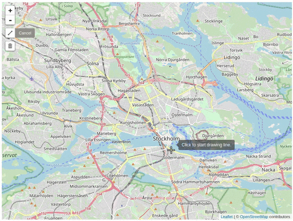
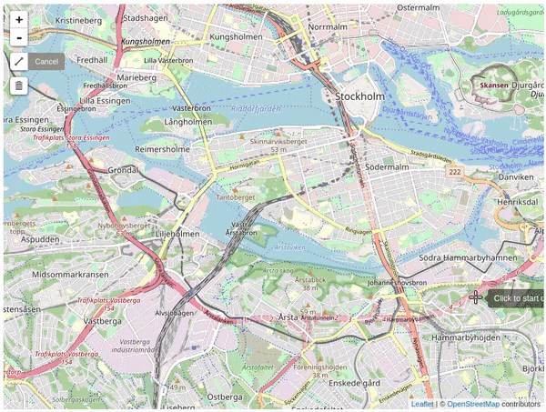
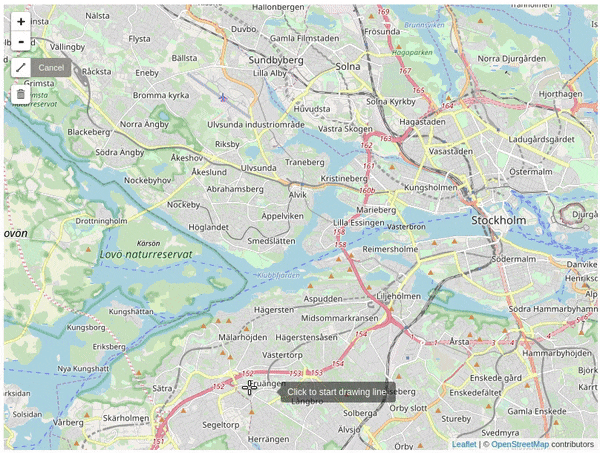
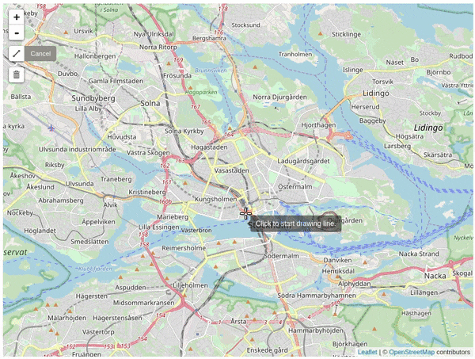

# Fast map matching (FMM)

This project is an implementation of the fast map matching (FMM) algorithm introduced in this paper [Fast map matching, an algorithm integrating hidden Markov model with precomputation](http://www.tandfonline.com/doi/full/10.1080/13658816.2017.1400548), which acelerates the performance by precomputation. A post-print version of the paper can be downloaded at my [home page](https://people.kth.se/~cyang/).

### Features of fmm

- Highly optimized code in C++ using Boost libraries (Graph and Rtree index)
- Considerable map matching speed
   - **25,000-45,000 points/sec** (single processor)
   - **200,000 points/sec** (parallel matching with 8 processor)
- [Customized output fields](https://github.com/cyang-kth/fmm/wiki/Input-and-output) (matched point,traversed path, gps error, etc)
- Support **city level** road network (100,000 edges tested) and **millions of GPS records**
- Tested on Ubuntu, :tada: Windows and :tada: Mac platform (C++ program).
- Python API (a preliminary version tested on Ubuntu and Windows system)
- :tada: A web application under the `web_demo` folder is designed for map matching on OpenStreetMap. A tutorial is provided at [OSM map matching](https://github.com/cyang-kth/osm_mapmatching) and screenshots are shown below.

 

 

### Installation, examples and documentation.

Check the [wiki](https://github.com/cyang-kth/fmm/wiki) for details.

### Acknowledgement

Great acknowledgement is given to [Edi Buslovich](https://github.com/edibusl) for improving the installation instructions.

### Contact and citation

Can Yang, Ph.D. student at KTH, Royal Institute of Technology in Sweden

Email: cyang(at)kth.se

Homepage: https://people.kth.se/~cyang/

Please cite fmm in your publications if it helps your research:

    Can Yang & Gyozo Gidofalvi (2018) Fast map matching, an algorithm
    integrating hidden Markov model with precomputation, International Journal of Geographical Information Science, 32:3, 547-570, DOI: 10.1080/13658816.2017.1400548

Bibtex file

    @article{doi:10.1080/13658816.2017.1400548,
    author = {Can Yang and Gyozo Gidofalvi},
    title = {Fast map matching, an algorithm integrating hidden Markov model with precomputation},
    journal = {International Journal of Geographical Information Science},
    volume = {32},
    number = {3},
    pages = {547-570},
    year  = {2018},
    publisher = {Taylor & Francis},
    doi = {10.1080/13658816.2017.1400548},
    URL = {
            https://doi.org/10.1080/13658816.2017.1400548
    },
    eprint = {
            https://doi.org/10.1080/13658816.2017.1400548   
    }
    }
