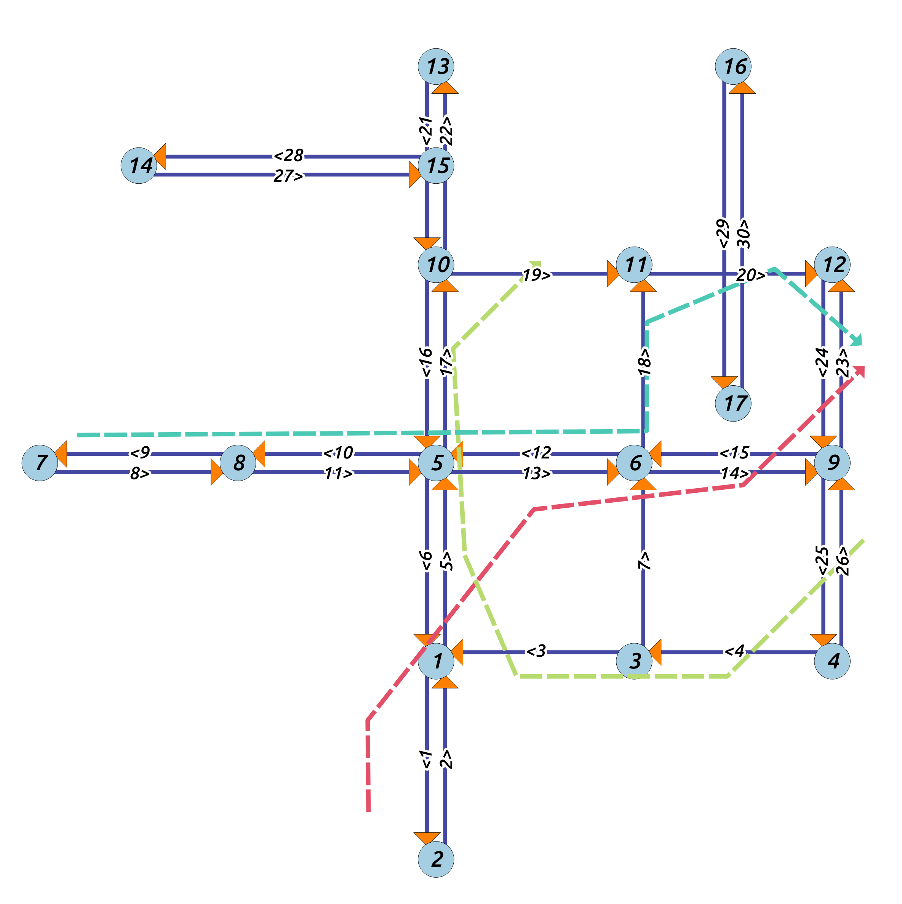

## Road network and GPS trajectories

- Input data
    + Road network data: data/edges.shp
    + GPS data: data/trips.shp, data/trips.csv, data/gps.csv
- Output data
    + ubodt.txt: an upper bounded origin-destination table in CSV format
    + mr.txt: the map matching result in CSV format

