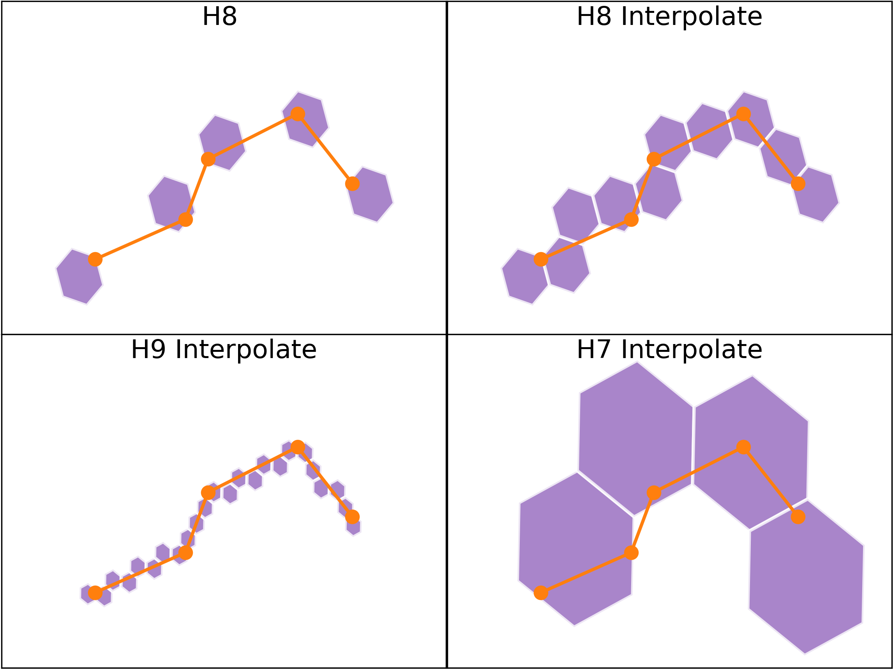

### Run match in command line

```
h3mm --gps traj.csv -o hex.csv --write_geom --h3level 9 --interpolate
```

### Jupter-notebook

Check the [h3demo.ipynb](h3demo.ipynb) notebook.

### Screenshots


