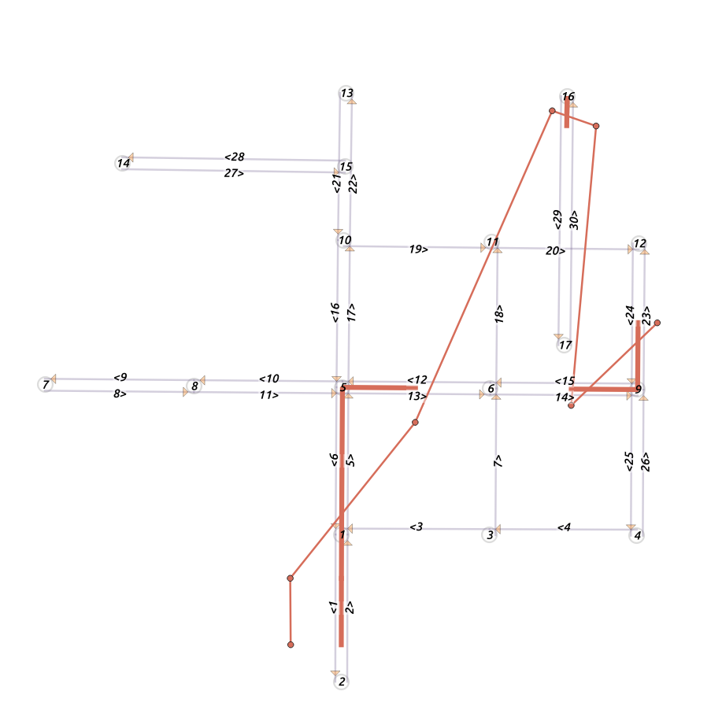

### Example of multi-segment map matching

If some parts of a trajectory is unmatched, then the trajectory will be split into multiple segments as shown below (the trip with id 3 in the `trips_outlier.csv`). An new field called `tgeom` is exported as a MultiLineString geometry. 

Run 

```bash
fmm fmm_config_csv.xml
```

 

The HMM probabilities are

```
ep: 0.792391,0.788102,0.896001,0.980199,0.923116,0.975345,0.966437
tp: 0.999961,0.756067,0,0.948683,0,0.895804
```

